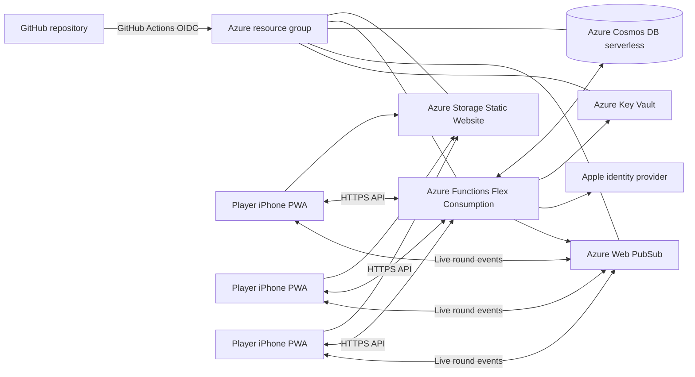

# Design: Väyläkaverit

## Goals

- Deliver an iPhone-first PWA that friends can open, add to the home screen, and use during a
  golf round without App Store distribution.
- Present the product to users as Väyläkaverit.
- Make the cloud backend the durable, authoritative source for scores, game state, and history.
- Keep the backend surface small: it owns identity, course data, persistent state, authorization,
  and low-volume real-time score events.
- Scale backend capacity to zero while unused and automatically add capacity as demand increases.
- Preserve a player's locally entered scores during a temporary connection loss and synchronize
  them when the connection returns.
- Use Azure managed services and infrastructure as code for the production environment.
- Keep application source, infrastructure, and deployment automation in GitHub.

## Non-goals

- Replacing a personal Garmin scorecard.
- Processing money or payments.
- Fully disconnected shared-game resolution.
- A peer-to-peer transport in the first release.

## Azure cloud architecture

### Runtime components

| Azure service                        | Responsibility                                                                                                                                                                                                 |
| ------------------------------------ | -------------------------------------------------------------------------------------------------------------------------------------------------------------------------------------------------------------- |
| Azure Storage Static Website         | Serves the installable PWA as static assets from Sweden Central.                                                                                                                                               |
| Azure Functions Flex Consumption     | Runs the HTTP API, score validation, game evaluation, invitation handling, and real-time event publication. It scales application compute to zero when idle.                                                   |
| Azure Cosmos DB serverless           | Persists player, round, score, game, invitation, and history records with request-based capacity.                                                                                                              |
| Azure Web PubSub                     | Delivers authenticated low-latency round updates to active round participants without application-managed WebSocket servers. The first release uses the Free tier, capped at 20 concurrent client connections. |
| Azure Key Vault                      | Holds the Apple identity-provider credentials and any other runtime secrets outside source control.                                                                                                            |
| Application Insights / Azure Monitor | Records request failures, latency, synchronization failures, and availability signals without storing score content or identity data in telemetry.                                                             |

All services are deployed into one Azure resource group per environment through Bicep. The initial
environment uses a region close to Finnish users, subject to service availability. The
implementation must verify the region, SKU availability, cold-start behaviour, and idle cost
against the one-second update objective before production deployment.

Cost guardrails are encoded in Bicep: Storage Static Website and Web PubSub use their lowest-cost
tiers,
Functions uses 512 MB Flex Consumption instances with no always-ready instances and a maximum of
five concurrent instances, Cosmos DB is serverless and non-zonal, Storage is Standard LRS, and
Application Insights stops telemetry after 0.1 GB of daily ingestion.

The PWA renders the round, accepts the current player's score input, displays a creator's QR
code, and subscribes to the round's live updates. It keeps a durable local outbox for a player's
own pending score changes during a temporary connection loss. It never decides a shared game's
authoritative outcome locally.

The backend exposes a small round-scoped API:

- create a round and its initial players;
- issue and consume an opaque QR invitation;
- hold a pre-play lobby where each participant confirms their own name, tee, handicap index, and
  rating table;
- start a ready two-to-four-player lobby as the round creator;
- create and configure games;
- enter or correct a player's own score;
- read live round state and completed history.

Each score mutation is authorized against the participant identity, persisted, evaluated by the
game engine, and published as a round update. This makes corrections deterministic and ensures a
reconnecting phone receives the same result as the phones that stayed connected.

New rounds are persisted in a `lobby` state. A lobby records its creator and a readiness flag for
each player. Changing a player's own required settings clears that flag unless the same mutation
explicitly reconfirms readiness. The server alone transitions a round from `lobby` to `active`,
after verifying that the creator made the request, the group has two to four ready players, and
the main game settings are valid. Score and side-game writes are rejected before that transition.
Both the in-memory preview store and Cosmos store preserve this state and use the same domain
validation.

### Source control and delivery

The complete application, Bicep infrastructure, documentation, and GitHub Actions workflows live
in a public GitHub repository under the `aautere` personal profile. Protected pull requests run
formatting, type checks, tests, OpenSpec validation, and infrastructure validation before merging.

The repository is published under the MIT License. No credentials, access tokens, client secrets,
or production data may enter source control; Azure Key Vault and GitHub secret storage hold the
minimal deployment and runtime secrets.

GitHub Actions deploys approved changes to Azure using OpenID Connect federation and least-privilege
Azure roles. No long-lived Azure credentials are stored in GitHub. Development and production use
separate application resources and configuration in the shared CAF-named `rg-vaylakaverit`
resource group. Production deployment requires an explicit approval step.

The GitHub deployment identity has Contributor access only. The Bicep deployment deliberately does
not create Azure RBAC role assignments. After provisioning, an Azure RBAC administrator runs the
repository's `azure-grant-function-storage-access.sh` harness script to assign the Function App's
managed identity the three required Storage data-plane roles on its backing account.

## Identity and access

Apple sign-in produces a persistent account for a player and unlocks their cross-device history.
A guest receives a limited, device-bound session that can join a round by QR code and contribute
only their own scores. The final implementation must define whether and how a guest can later
claim their history after creating an Apple account.

The QR code contains an opaque, high-entropy sharing URL or token. Its bearer may view the shared
round and history, but cannot alter scores. The round owner must be able to revoke or replace the
token. The backend enforces the two-to-four player limit and authorizes every score mutation
rather than trusting the client.

## Data model

The persistent model is deliberately small:

| Entity            | Responsibility                                                                                               |
| ----------------- | ------------------------------------------------------------------------------------------------------------ |
| Course, tee, hole | Golf Talma Master, its tees, pars, stroke-index data, and hole order                                         |
| Player identity   | Apple account or guest session and display name                                                              |
| Round             | Selected course, players, start/end state, and invitation                                                    |
| Round player      | Player's selected tee and handicap index for that round                                                      |
| Player profile    | A signed-in player's changeable default rating table for handicap calculations; it starts as the men's table |
| Score             | One participant's stroke count for one hole, with a revision history or audit metadata                       |
| Game              | Selected hole range, participants, scratch/handicap mode, reward label, and tie settings                     |
| Game result       | Per-hole winners, carried-win state, live standing, and final outcome                                        |

The course data must include the official playing-handicap lookup ranges and values for each tee
and rating table, plus the hole stroke indexes used to allocate handicap strokes. The system uses
the lookup value directly rather than recalculating it from a formula.

## Implementation decisions

### Technology

- PWA: React, Vite, PWA plugin, Tailwind CSS, TanStack Query, and IndexedDB score outbox.
- API: TypeScript Azure Functions using the Node.js v4 programming model.
- Data: Azure Cosmos DB for NoSQL in serverless mode, with mutable live-round records partitioned
  by `/roundId`.
- Live updates: Azure Web PubSub Free tier for joined round participants, capped at 20 concurrent
  participant connections for the first release.
- Authentication: Sign in with Apple via the API and device-bound guest sessions.
- Validation and shared contracts: Zod.
- Testing: Vitest and Playwright.
- Infrastructure: Bicep, Azure CLI, and GitHub Actions OpenID Connect federation.

### Talma Master data

Golf Talma's official Master page is the approved authoritative source for the first course:
<https://golftalma.fi/master/>. It publishes the Master scorecard and separate men's and women's
slope tables for tees labelled 48, 52, 56, 60, and 64.

The published slope-table images show a June 2017 date. The product owner accepted these official
published values as the first-release source on 25 August 2026; no separate club confirmation is
required. The import records the source URL and retrieval date so a future update can be reviewed
and versioned deliberately.

The PWA displays a tee label exactly as configured by the course. Each course has one configured
default tee, which a player can change for their round; the application does not infer a default
from a tee's colour or number. Golf Talma Master uses tee 52 as its configured first-release
default.

For handicap calculations, a signed-in profile starts with the men's rating table as a convenience
default. This is a calculation setting, not stored self-identified gender. The player can change
the profile default and override it for any individual round.

Handicap match-play games use the course's official looked-up playing handicap with a fixed 100%
allowance. The lowest playing handicap among a game's participants is the comparison baseline.
Every other participant receives the non-negative difference from that baseline as handicap
strokes. Strokes are assigned by ascending hole HCP index from 1 through 18 and repeat in the same
order when the difference exceeds 18. A negative playing handicap may be the baseline; it does not
receive penalty strokes. These are fixed first-release rules, not per-game settings.

## Game evaluation

The backend game engine evaluates all games affected by a submitted or corrected score. It:

1. determines each participant's gross score and, for handicap games, subtracts their
   game-specific relative handicap strokes for the hole;
2. determines the hole outcome according to the game's selected tie rule;
3. carries an unresolved win forward only when configured;
4. applies the configured set of eligible players for resolving a carried win; and
5. publishes the updated state to all round participants.

For a shared multi-player game, the standing is the number of holes won by each player. When a
game reaches the end of its selected range with no overall winner, the selected end-tie rule
either records a draw or extends the game one hole at a time until there is a winner. The
system records an extended game as unresolved, with no winner or draw, if the round ends before it
is resolved.

## Reliability, offline, and performance

The backend persists a score change and its recalculated game state before confirming success to a
client. A confirmed score therefore survives service restart or client refresh even though the
first release has no formal availability SLA.

The PWA persists each participant's pending own-score changes locally, shows that they are
waiting to synchronize, and sends them in order when connectivity returns. It reloads the
authoritative backend snapshot before reconciling the outbox, so it does not silently overwrite
newer data.

Under normal supported mobile-network conditions, a persisted score or correction should appear
for other active participants within one second. Functions compute and Cosmos DB request capacity
scale to zero when unused. The first-release Web PubSub Free tier is deliberately capped at 20
active participant connections; an operational alert triggers a Standard-tier upgrade before the
cap is reached.

Only joined round participants receive a Web PubSub connection. Link-only viewers read the latest
persisted round snapshot over HTTPS and may refresh it, so spectator viewing does not consume the
limited live-connection pool.

The PWA must support Safari and Chrome on the current and two immediately preceding iOS major
versions. Its primary round flows require high contrast, large touch targets, one-handed use, and
WCAG AA conformance.

## Failure handling

- The client shows pending state until a score mutation is confirmed by the backend.
- On reconnect, the client reloads the authoritative round snapshot before applying new events.
- If another participant has updated the same data, the backend returns the current revision and
  the client asks the player to resolve the conflict rather than silently overwriting it.
- If live delivery is temporarily unavailable, persisted changes remain visible after refresh;
  the client communicates that the live view is reconnecting.
- When a user deletes their account, the backend removes or anonymizes their identity in shared
  rounds while preserving the other participants' history.

## Local preview mode

Local preview runs the PWA and API without Azure, Apple sign-in, or cloud credentials. The API
uses an in-memory store seeded with realistic Golf Talma Master rounds and a local guest identity.
The PWA replaces QR camera scanning with a local join link, while preserving the same join-token
and round-state flow used by production.

Preview mode must cover round creation, joining from two browser sessions, score entry and
correction, scratch and handicap match play, side games, and completed-game history. This is an
end-to-end product test surface, not a static mockup. Preview is an internal runtime configuration;
it does not alter or label the player-facing product experience.

## Testing strategy

- Unit-test the game evaluator for scratch, handicap, tied-hole, carried-win, multi-player, and
  score-correction cases.
- Integration-test authorization so a participant cannot change another player's score.
- Test QR invitations for valid joining, expired/revoked invitations, and a full round.
- Test two to four browser clients receiving a score update and a correction in real time.
- Test the PWA on an iPhone-sized Safari viewport and its install-to-home-screen path.
